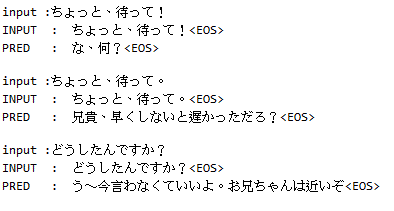
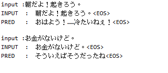
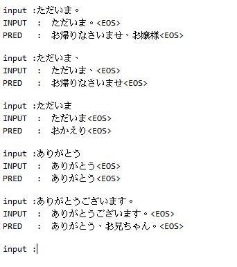

# Seq2Seq model in numpy

LSTM sequence encoder-decoder model in numpy.

## environment:
* Python 3.5
* Numpy 1.14
* numba 0.39.0
* (optional) mpi4py

## .py file:
* data_importer.py: subsidiary code, for inputing dictionary, data, and some functions.
* seq2seq.py: training mode. (due to privacy issue, training data isn't uploaded.)
* tester.py: interactive test mode. (Infer mode)
#### nomenclature are descripted in sub-directory "ML"

## training data:
training data source: [小説家になろう](https://syosetu.com/)
*  conversation training data: 
1. 80,000 sentences (specific character conversation: younger sister(妹属性))
2. 660,000 sentences (specific character conversation: general)

* word2vec training data (Using genism):
1. 200 MB txt data  

## computation cost:
* 1 CPU, 1 week training.

## result:

# Project:

## data preparing
1. dictionary: statistical method. 

[see introduction/define_vocabulary](https://github.com/hchungdelta/Simple_NN_API/tree/master/NN_v2.0_seq2seq/introduction/define_vocabulary) 

2. training data : conversations from novel.
Extracting the conversations from novels  

[see introduction/extract_conversation](https://github.com/hchungdelta/Simple_NN_API/tree/master/NN_v2.0_seq2seq/introduction/extract_conversation)

3. character-specific conversation: 
Extracting character-specific conversations from all conversations  

[see introduction/extract_character_specific_conversation](https://github.com/hchungdelta/Simple_NN_API/tree/master/NN_v2.0_seq2seq/introduction/extract_character_specific_conversation)

## neural network
1. LSTM mechansim
[see introduction/LSTM](https://github.com/hchungdelta/Simple_NN_API/tree/master/NN_v2.0_seq2seq/introduction/LSTM)

2. Seq2seq model
[see introduction/seq2seq](https://github.com/hchungdelta/Simple_NN_API/tree/master/NN_v2.0_seq2seq/introduction/seq2seq)

## training model
An embarrassingly parallel computing is implemented automatically in this API (if available).
The detail is illustrated in [ML/TrainModel](https://github.com/hchungdelta/Simple_NN_API/tree/master/NN_v2.0_seq2seq/ML/TrainModel)

## pre-trained data

Due to the size limitation of Github, I store the pre-trained data on [google cloud](https://drive.google.com/open?id=1xCA30CqdKjfHIyVLCjmaZb0brawvWJ43). 
Just to create a new directory named "data" in this directory, and download the pre-trained data to this "data" directory.  

