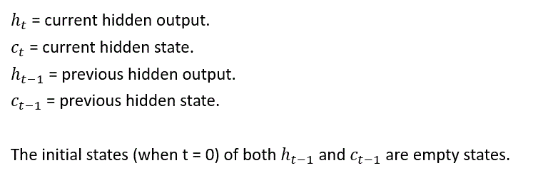
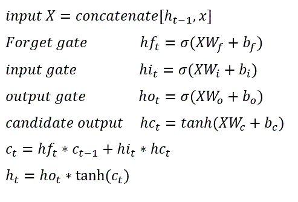
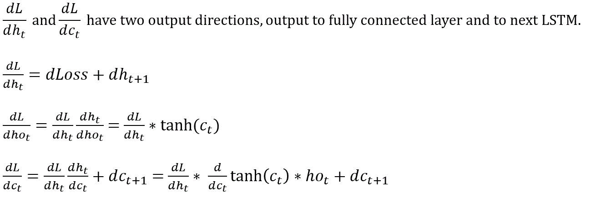
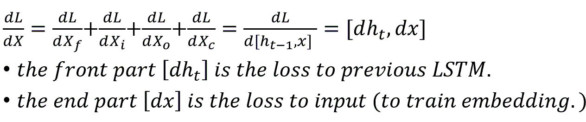

# LSTM (Long Short-Term Memory)
LSTM is developed [by Hochreiter & Schmidhuber (1997)](http://www.bioinf.jku.at/publications/older/2604.pdf)

One can refer to [Christopher Olah's blog](http://colah.github.io/posts/2015-08-Understanding-LSTMs/) for a fantastic introduction. Or [Agustinus Kristiadi's blog](https://wiseodd.github.io/techblog/2016/08/12/lstm-backprop/) for tutorial code, which straightforwardly shows how the propagation work. 
I really benefit a lot from these two articles. Here I would like to write the mechanism in a mathematical form.

The code of LSTM mechanism can be found in [ML/Layer/LSTM_layer.py](https://github.com/hchungdelta/Simple_NN_API/blob/master/NN_v2.0_seq2seq/ML/Layer/LSTM_layer.py)

## Forward propagation:

## Backward propagation:

First, to derive the last equation in forward propagation (ht).

Based on the previous result, we move on to derive the second last equation in forward propagation (ct). 

To derive weights, biases, and also the loss. Here I only show the forget gate part since the other three equations can be derived in the similar way.

Sum up the losses, and send to previous LSTM layer (and embedding input).

