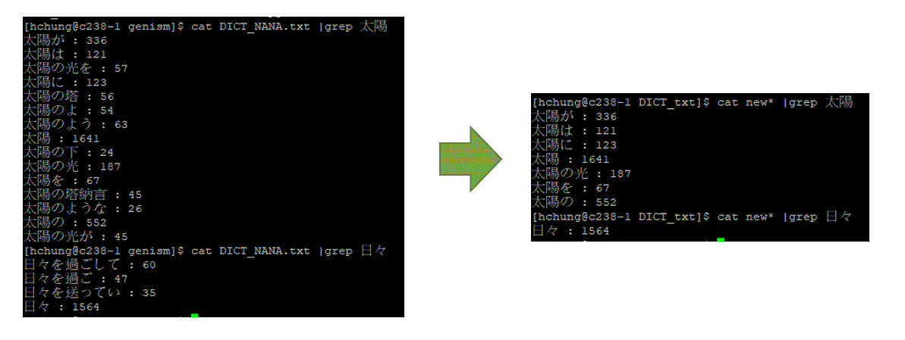
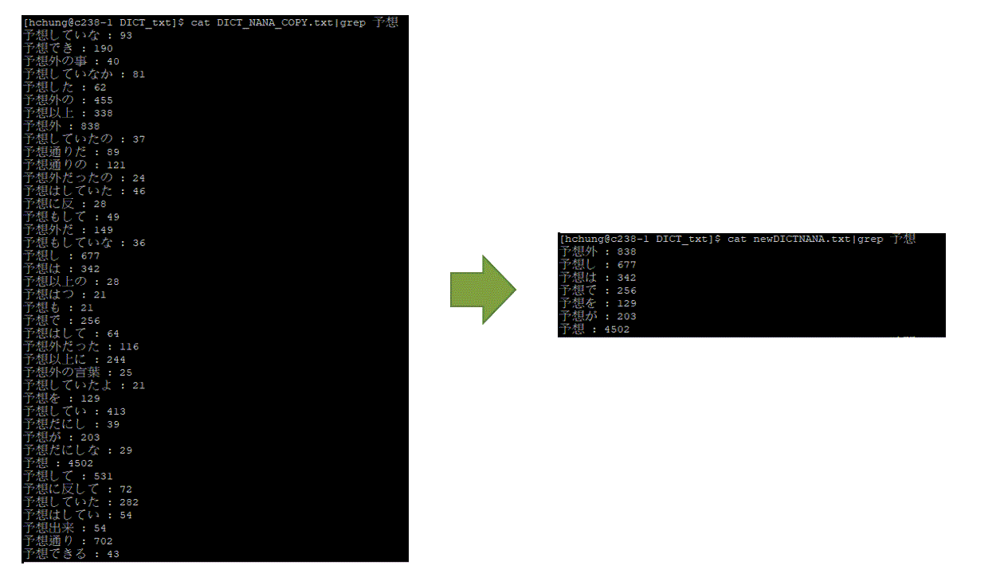
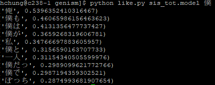

# Define vocabulary

Unlike English, commonly in the Japanese language(and also Chinese), the sentence is constructed by word in consecutive order, without space to separate the word.
For example:


```
English: I went to the office, but no one was there
日本語: 私はオフィスへ行ったけど、誰もいなかった
```
If we write this sentence In English vein, it would look like:
```
日本語:-私-は-オフィス-へ-行った-けど、誰-も-いなかった
```

In English, the most straightforward approach to construct an dictionary is to one-hot the vocabulary, and then construct a word embedding based on it for later usage.  (of course, there are some problems inherited in English, many new mechanisms are suggested to overcome these issue such as [Character-based method](https://arxiv.org/abs/1511.04586).)

It indicates that the vocabulary cannot be easily distinguished from a sentence without a basic understanding of the Japanese language.
Hence we need to contstruct/define a dictionary first.
Many vocabulary-separated mechanisms have been developed such as [mecab](http://taku910.github.io/mecab/), which can reach high accuracy in parsing sentence. However, here I want to try an idea, *is human-like grammar analysis to be necessary?*

## Statistical method:

This is a naive idea for vocabulary-searching. Aspiring by the fundamental idea of word2vec, I write a code to record the frequency of each candidate vocabulary, if a combination of individual characters to be of high frequency, it is likely to be a defined vocabulary. In practice: 


200MB txt novel data from ([小説家になろう](https://syosetu.com/)) are used for vocabulary-searching, I set the upper limit of the vocabulary length to be 7. If the frequency of certain combination is larger than 120, it will be registered in dictionary.

There are three issues arise in this method. 
* duplicate information
* lengthy vocabularys
* postpositional particle　格助詞「て、に、を、は、が」

#### Duplicate information
It is necessary to delete "duplicate information", for example, it is easy to imagine that in this method the dictionary will register the following vocabulary.
```
オフィス  (like office)  --> true vocabulary
フィス    (like   fice)  --> false vocabulary
ィス      (like    ice)  --> false vocabulary
```

However, This can be easily solved by check the frequency, since characters are coupled together, so they share a similar frequency. 
The idea is as follows.
```
if subword in word:   # word2 is a sub-vocabulary of word1
    if tolerant_rate1*frequency(subword) > frequency(word) > tolerant_rate2*frequency(subword):
        expr(word replace subword)
# tolerant_rate1 = 1.1    #chosen empirically. 
# tolerant_rate2 = 0.9    #chosen empirically. 
```
In this case, オフィス will replace フィス and ィス.

#### Lengthy vocabularys

Lengthy vocabularys are also a problem since it carries a plethora of information, for example "オフィスへ行った" can be viewed as a vocabulary if the appearance of this sentence is quite often. It had better to be separated the sentence into オフィス+へ+行った. One way to solve this problem is to check the frequency of the sub-vocabularies appear in the lengthy vocabulary (オフィス,行った in this case). If the frequencies of sub-vocabularies are much higher than the lengthy vocabulary, it will be omitted from the dictionary.

The idea is as follows.
```
if subword1, subword2 in word:   
    if  frequency(subword1)*frequency(subword2) > threshold*frequency(word)  
    expr(omit word from dictionary)
# threshold = 3 #chosen empirically. 
```

The results are as follow. After this approach, the amount of vocabulary is reduced by 50%.




#### Postpositional particle　格助詞「て、に、を、は、が」

I haven't delved into solving this problem since I expect this problem can only be solved by using much larger data (>> GB).
Since we can see many vocabularies are in the form of "Noun + postpositional particle." We can check the frequency of "Noun," and the then compare to those of "Noun + postpositional particle." One can expect the amount of the root word "Noun" can overwhelm the branch words with postpositional particle followed by. This will serve as one of my future works once I enter the GB-scale data realm.

Nonetheless, after solving the first two problems, and the amount of vocabulary has been reduced to less than 25% (150k to 40k). It provides an affordable calculational cost for a normal CPU node.
Of course, the word2vec similiarity check result is quite reasonable (using genism)



僕 is similar to 俺, 僕が, 私 ... etc. Despite the appearance of postpositional particles, they do share similar embedding vector. It is an acceptable vocabulary basis-set for seq2seq training. 


