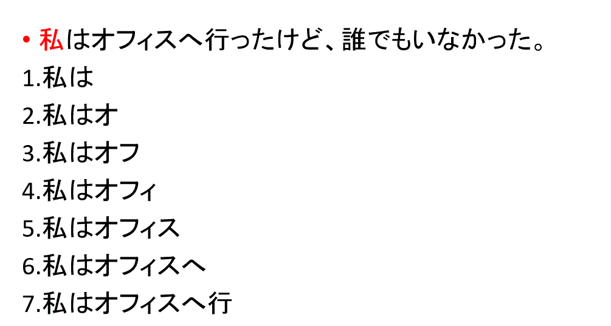
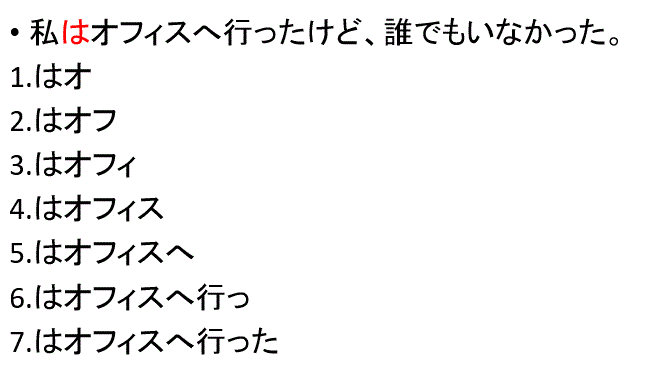

# Define vocabulary

Unlike English, commonly in the Japanese language(and also Chinese), the sentence is constructed by word in consecutive order, without space to separate the word.
For example:


```
English: I went to the office, but no one was there
日本語: 私はオフィスへ行ったけど、誰もいなかった
```
If we write this sentence In English vein, it would look like:
```
日本語:-私-は-オフィス-へ-行った-けど、誰-も-いなかった
```

In English, the most straightforward approach to construct an dictionary is to one-hot the vocabulary, and then construct a word embedding based on it for later usage.  (of course, there are some problems inherited in English, many new mechanisms are suggested to overcome these issue such as [Character-based method](https://arxiv.org/abs/1511.04586).)

It indicates that the vocabulary cannot be easily distinguished from a sentence without a basic understanding of the Japanese language.
Hence we need to contstruct/define a dictionary first.
Many vocabulary-separated mechanisms have been developed such as [mecab](http://taku910.github.io/mecab/), which can reach high accuracy in parsing sentence. However, here I want to try an idea, *is human-like grammar analysis to be necessary?*

## Statistical method:




