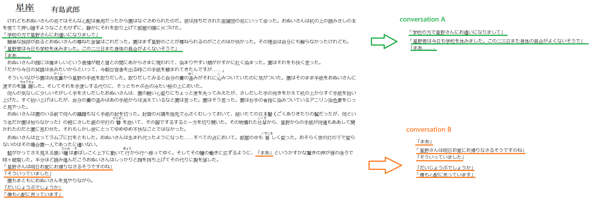
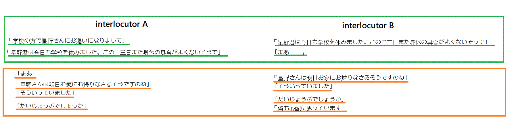

# extract conversation from novels

The conversation can be easily extracted by punctuations 「」.
However, in many circumstances, two or more sentences extracted by this approach may not be related.
In other words, these are not a conversation between people.

In order to extract "the conversation between people", of course the-state-of-art machine learning is possible to archive this.
However, it is beyond the score of my current focus.
Therefore I adopt a rough way to solve this. I set up a threshold for "sentence distance" between sentences in the novel. 
It is common to imagine that if two sentences appear in a row in the novel, it is highly likely that these sentences are conversations between two or more people.
The following is an example of this approach:

In the example, two conversations are extracted (green and orange underlines), by rearranging the conversation, they can now serve as seq2seq training data.  As what follows.

