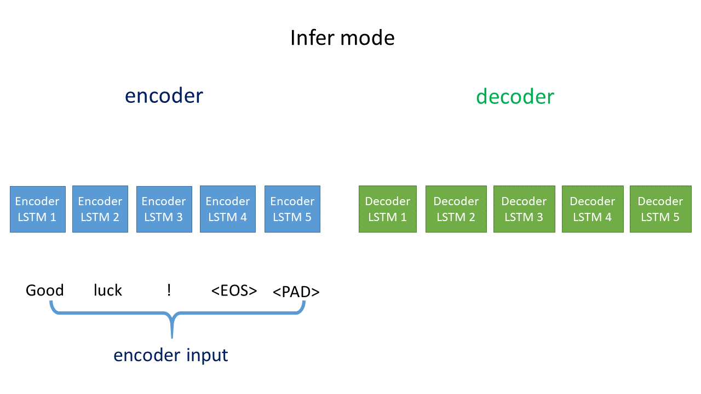

# Seq2seq model (Encoder-Decoder structure)

* \<GO>: start token.
* \<EOS>: end token.
* \<PAD>: blank token.

Encoder and decoder are two different LSTM sequences, both have its own weights and bias. The encoder will send to the final hidden state (c) and final hidden output (h) to the decoder as a initial state, as depicted by a purple arrow in the picture above. 

Two mode are supported in this API, gifs are provided below for better visualize the process.

* **teacher forcing mode**: using decoder input to help train the model. 
* **infer mode**: without decoder input, predicting the next word by previous output.

