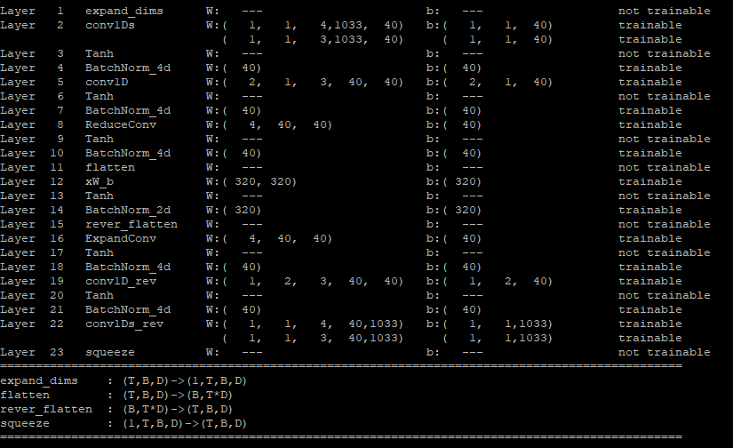

# SandGlass
Since the neural network architecture of this model looks like sandglass, I temporarily call this model SandGlass.
[see overview for further information](https://github.com/hchungdelta/Simple_NN_API/blob/master/NN_v3.0_SandGlass/introduction/overview/README.md)

The model will show the information of the training neural network structure at the beginning.

## environment:

* Python 3.5
* Numpy 1.14
* numba 0.39.0
* (optional) mpi4py

## .py file:
* **main.py**: training mode.
* **data_importer.py**: subsidiary code, for inputing dictionary, data, and some functions.
## training data:
* 30 and 1000 conversations from Southpark are restored in trainingdata/json for testing purpose. (notes that many swear words appear...) 

## Update:
#### layers: 
* 5 different kinds of convolutional layers (see [introduction/equation](https://github.com/hchungdelta/Simple_NN_API/tree/master/NN_v3.0_SandGlass/introduction/equation))

* attention mechanism (see [introduction/attention_mechanism](https://github.com/hchungdelta/Simple_NN_API/tree/master/NN_v3.0_SandGlass/introduction/attention_mechanism))

#### normalization:
BN(Batch Normalization)
#### training model:
[see TrainModel](https://github.com/hchungdelta/Simple_NN_API/tree/master/NN_v3.0_SandGlass/ML/TrainModel)
#### other:
swapper: randomly exchange two input. (e.g. I am here. -> I here am.)
