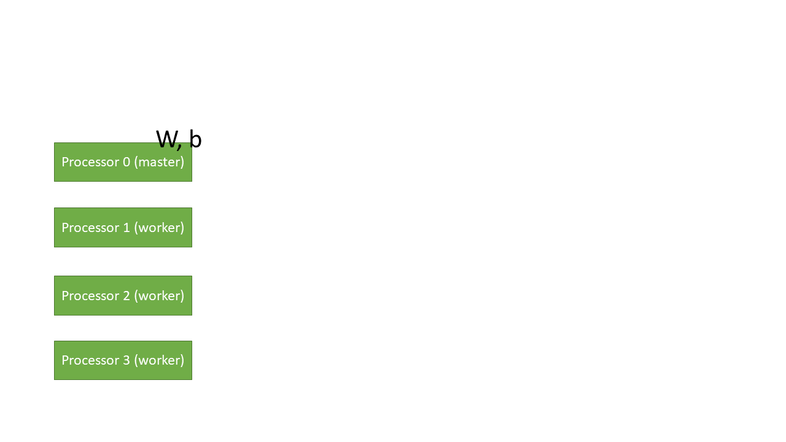

# Training Model
EndeModel is short for the Encoder/Decoder Model.
This model determines how to update the weights and bias in each layer.
The functions of this model:

#### 1. How to update the weights and bias in each layer.
* learning rate
* optimizer : support SGD, momentum, and adam.
```
#example
EndeModel = ML.EndeModel.Model(lr=0.0012,mode="adam") #lr is short for learning rate.
EndeModel.add(xW_b) #register the trainable layer.
EndeModel.add(tanh)
EndeModel.add(xW_b)

...(coding)...

```

#### 2. Save and restore in pickle
```
# usage
EndeModel.Save('data_path.pickle')
EndeModel.Restore('data_path.pickle')
```

#### 3. Embarrassing parallel computing

If parallel computing is available, the model will broadcast the same initial weights/bias to all processors at the beginning.
```
# initializer
if EndeModel.comm != None :
    EndeModel.Bcast_Wb(initial=True)
```
And also, one must make sure the training data are separated to each processor correctly, as  in ```main.py```.
Only three lines are needed to train the model.

```
output = EndeModel.Forward(input)
pred, L, dLoss = ML.NN.Loss.timestep_softmax_cross_entropy(output, target)
EndeModel.Backprop(dLoss)
```

If using infer mode, the first two lines is enough.
```
output = EndeModel.Forward(input)
pred, L, dLoss = ML.NN.Loss.timestep_softmax_cross_entropy(output, target)
```

The following illustrates the process of training with parallel computing.



