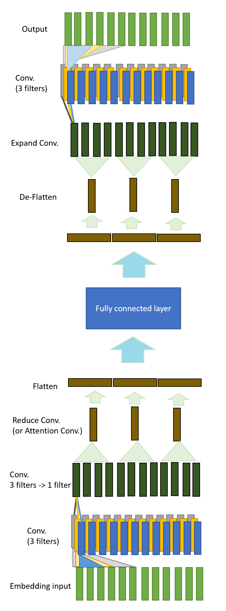
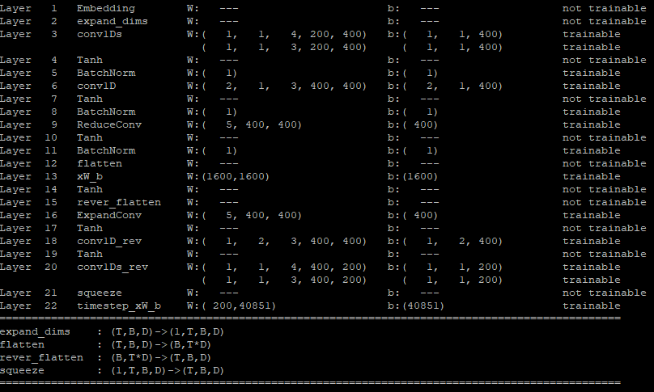

# SandGlass
Since the neural network architecture of this model looks like sand glass, I temporarily call this model SandGlass.

#### Layers: 
Fully connected layer, 5 different kinds of convolutional layers (see [introduction/equation](https://github.com/hchungdelta/Simple_NN_API/tree/master/NN_v3.0_SandGlass/introduction/equation))
#### Support activation: 
GLU(Gated Linear Units), GTU(Gated Tanh Units), tanh
#### normalization:
BN(Batch Normalization)

## Basic idea:
* Autoencoder
* Inception
[Christian Szegedy, Sergey Ioffe, Vincent Vanhoucke (2016)](https://ai.google/research/pubs/pub45169)
* Attention
[Dzmitry Bahdanau, Kyunghyun Cho, Yoshua Bengio (2014)](https://arxiv.org/abs/1409.0473)
* Batch Normalization
[Sergey Ioffe, Christian Szegedy (2015)](https://arxiv.org/abs/1502.03167)
* Batch Renormalization
[Sergey Ioffe (2017)](https://arxiv.org/abs/1702.03275)

| our brain       |      in neural network      |            description   |
| :---:           |           :---:             |            :---:         | 
|stimulus         |    encoder conv. part       | receive the information, translate into our brain. | 
| brain processing|center fully connected layer |    process the information. |
| response        |     decoder conv. part      |  verbalize the information. | 

## Pros:
- Compare to traditional seq2seq model, this mechanism is less likely to lose information.
- Easy to perform parallel computing, expected to be trained faster.
- Can be trained without decoder input. 
- Relatively robust, since the prediction is dependent on the whole corpus rather than highly depends on the previous output.

[see introduction/performance](https://github.com/hchungdelta/Simple_NN_API/tree/master/NN_v3.0_SandGlass/introduction/performance)

## Cons:
- more complicated, more hyperparameters.
- less dependent on previous output, which could lead to less fluency.

## Future work:

#### brain processing part
* Memory 
* personality (persona embedding)

In this model, I expect the brain processing part can be expanded to larger, deeper scale (incorporate personal embedding, memory).
If the stimulus part and the response part are well-trained, the brain processing part can be "replaceable". 

My idea is that, if we are the native speakers of a certain language, of course, we can easily understand and fluently express ourselves fluently using that language. However, to a certain question usually we have a variety of replies, and different options toward some issues, which means the stimulus-response system is not always one-to-one related and makes the human languages very versatile.
Since our brain processing provides different connections between the stimulus and the response, depends on previous experience and personality ...etc.
Nowadays, natural language processing makes an unprecedented breakthrough, Google does an excellent job on this. To some degree, AI can defeat real human. The next step I think is, make AI more human-like. Since the training data are usually very general, without identity, in order to make the most out of it. (A digression - In "Ghost in the shell" language - AI lacks ghost line)

#### stimulus & response part.
* Dropout
* Mess up  (You can what understand said I even if sentence mess up I like this.)
* [Transformer](https://arxiv.org/abs/1706.03762)
* [google bert](https://arxiv.org/pdf/1810.04805.pdf)
* Encode the position of the words.

#### Can exploit information other than words?
* Encode "the sound" of the words. (make "no!" equals to "noooooo!")
* In hierarchy method? (only used when necessary)
