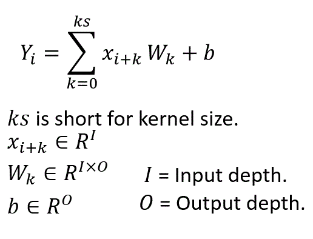
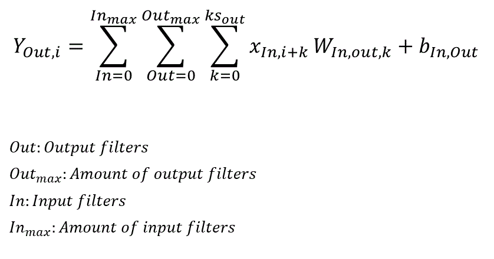
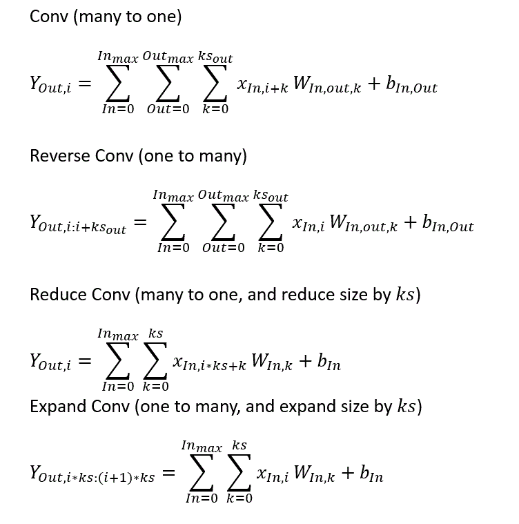
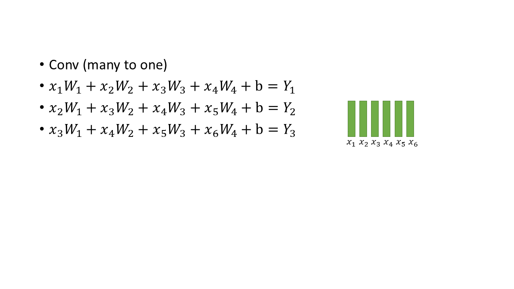
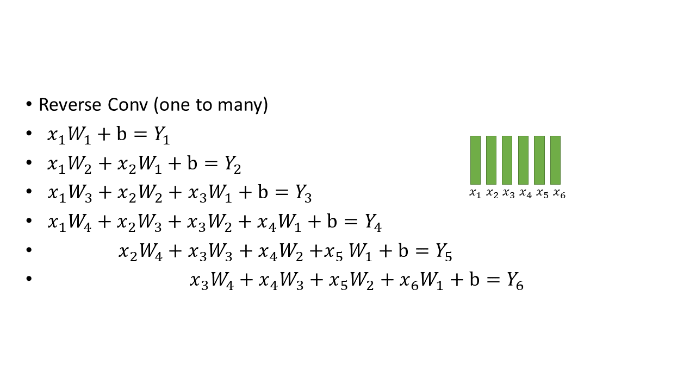
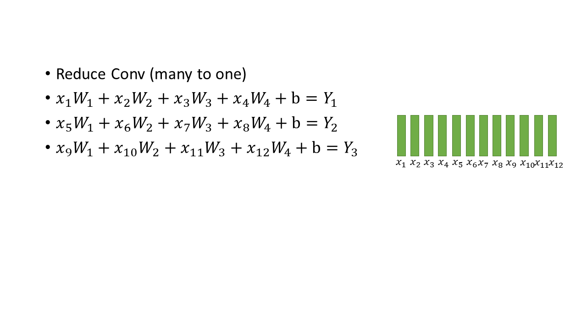
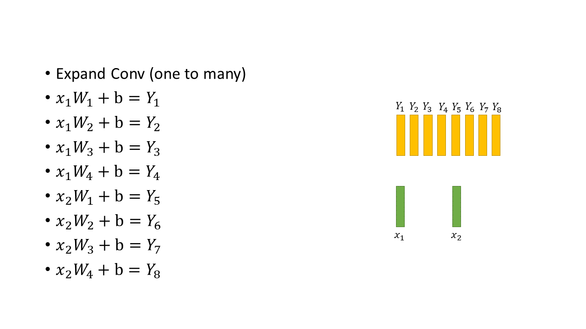
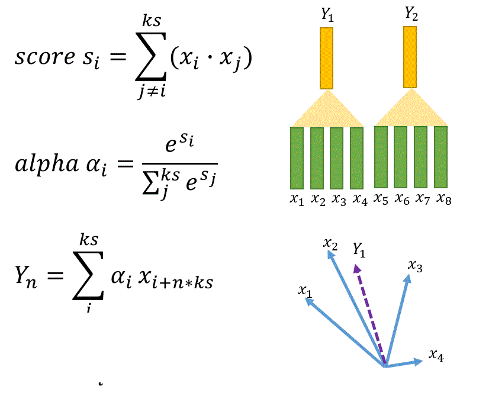
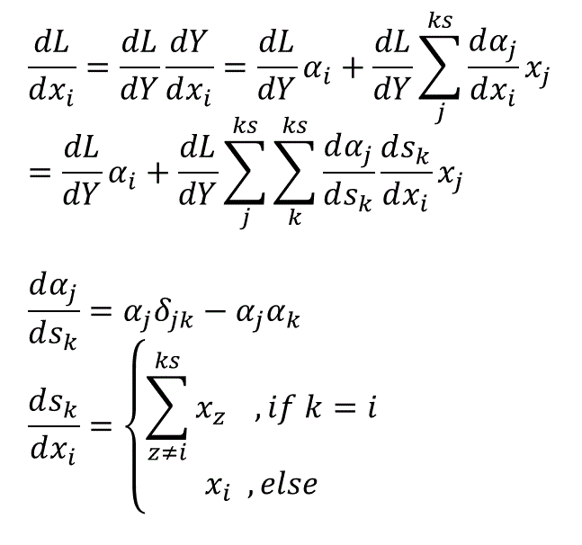
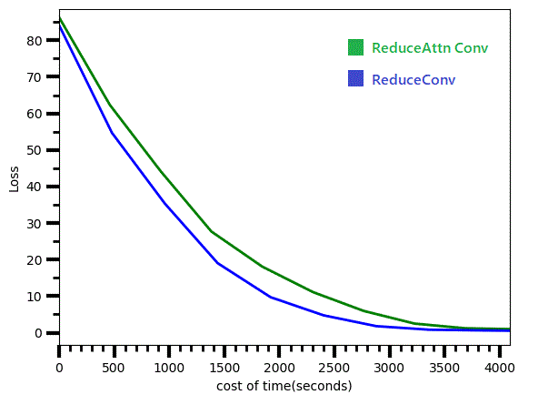

# SandGlass Conv2Conv model

The basic building block is the following equation. 

 

"x" is the inputs (embedding or previous convolutional layer). It gathers the information from previous layers. Hence each output possesses the information of the kernel size amount of inputs. The more the convolutional layers, the more the information it can gain.

As in CNN, the amount of filter can be more than one, and could have different kernel sizes.
Therefore, in general, the equation can be expressed as:

Based on these ideas, I have further developed three other types of convolutional layers, including reverse convolutional layer (reverse conv.), reduce convolutional layer (reduce conv.), and expand convolutional layer (expand conv.) As what follows:

## others:

#### Reduce Attention Conv:
Usage is similar to reduce convolutional layer. However, this convolutional layer doesn't have any hyperparameter.

The fundamental idea is to extract the most "meaningful" vector from the previous layer by the weighted sum.
The algorithm is presented as following, the schematic diagram is on the right below.
 
 

The backpropagation part:

Currently, although the reduce attention convolutional layer can replace the reduce convolutional layer, there is no clear evidence to show this reduce attention convolutional layer can outperform the reduce convolutional layer. As the following diagram illustrates the efficiency of both layers. Some improvements are needed.

