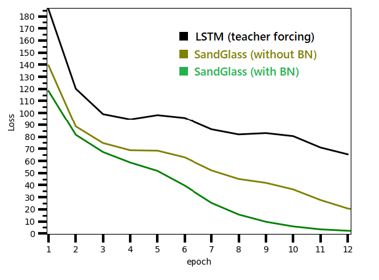
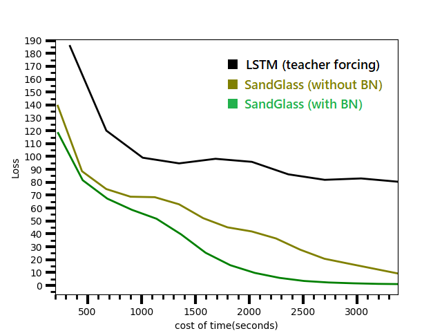
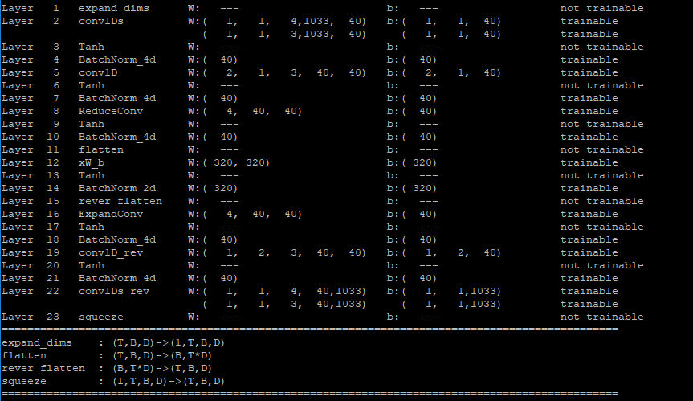

# Performance test 


## Test model:
```
1. LSTM teacher foring mode (black line)
2. SandGlass without Batch Normalization (olive line)
3. SandGlass with Batch Normalization (green line)
The diagrams are shown below.
```

## Loss-epoch curves 



BN is short for batch normalization. The results show that both SandGlass models (with/without BN) can outperform traditional LSTM. 

## Loss-time curves



Regarding efficiency, both SandGlass models can also be trained faster than traditional LSTM.


Caution: this is a comparison for small-scale data training.

## Test model detail:
```
sentence length: 32 (without cutoff, in order to compare these models on the same footing.)
batch: 100
epoch: 20 steps (run through 2,000 data)
Optimizer: adam
learning rate: 0.002
training data: 1,000 sentences from south park's script.
amount of vocabulary: 1033 (without using pre-trained embedding vectors)
```

- **SandGlass**: 
 


- **LSTM**:
```
Dense layer (1033 x 80) -> Bi-RNN -> decoder RNN -> Dense layer (320 x 1033)
hidden units = 320
```


