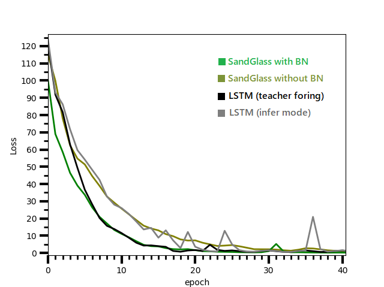
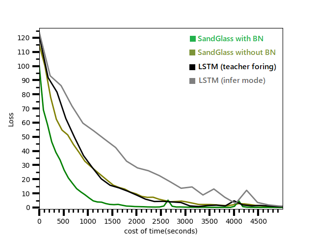

# Performance test 


## Test model:
```
1. LSTM teacher foring mode (black line)
2. LSTM infer mode (gray line)
3. SandGlass + Batch Normalization (green line)
```
## Test model detail:
```
sentence length : 32 (without cutoff, in order to compare these models on the same footing.)
LSTM:
Dense layer (1033 x 80) -> Bi-RNN -> decoder RNN -> Dense layer (320 x 1033)
hidden units = 320
```


```
Optimizer: adam
learning rate: 0.002
training data: 1,000 sentences from south park's script.
amount of vocabulary: 1033 (without using pre-trained embedding vectors)
```

SandGlass: 


## Loss-epoch curves 



BN is short for batch normalization. The results indicate that in terms of loss-epoch tendency, the performance of this model is similar to LSTM (infer mode). If includes BN, the model can converge much faster, approaches to the performance of LSTM (teacher forcing mode). In general, SandGlass conv2conv2 model can approach to lower loss with less fluctuation.

## Loss-time curves



In terms of efficiency, the results indicate that the cost-performance of this new model can outperform LSTM. It is interesting to see that even without BN (curve with olive color), the convergence rate is still comparable to LSTM (teacher forcing mode). 


